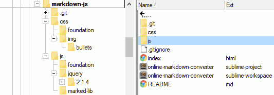

# Markdown App - Online Converter with JS



index.html

```html
<!DOCTYPE html>
<html lang="en">
<head>
    <meta charset="UTF-8">
    <title>md2html</title>
    <!-- https://github.com/chjj/marked  -->
    <link href="css/foundation/foundation.min.css" rel="stylesheet">
    <link rel="stylesheet" href="css/style.css">
    <style>
        .page-wrapper{
            margin:20px;}
        .tight{
            margin:0 3px 3px 0px;}
        .tiny{
            text-transform: uppercase;}
        .rendered h3{
            color: #777;}
    </style>
</head>
<body>
<div class="page-wrapper">
<!-- - - - - - - - - - - - - - - - - - - - - - - - - - - - - - -->
<h1 class="text-center">Markdown to HTML Converter</h1>
<div class="row">
    <div class="large-12 columns">
        <div class="tight">Insert Example Markdown</div>
      <button id="btn_headings" type="button" class="tiny button tight">headings</button>
      <button id="btn_ul" type="button" class="tiny button tight">list</button>
      <button id="btn_md_all" type="button" class="tiny button tight">comprehensive</button>
    </div>
</div>
<div class="row">
    <div class="large-8 columns">
        <textarea name="plain" id="plain_text" cols="115" rows="12" placeholder="Enter or paste markdown text here."></textarea>
        <button id="btn_convert" type="button" class="small button">CONVERT</button>
    </div>
    <div class="large-4 medium-12 small-12 columns">
        <textarea name="plain" id="plain_html" cols="115" rows="12" placeholder="Text converted from markdown to HTML will appear here."></textarea>
        <button id="btn_copy_to_clipboard" type="button" class="clip-btn small button" data-clipboard-target="#plain_html" data-clipboard-action="copy">Cut to Clipboard</button>
        <span class="copy-status"></span>
    </div> 
</div> 
<div class="row">
    <div class="large-12 columns rendered">
        <h3>Rendered HTML &#8681;</h3>
        <div id="rendered_content"></div>
    </div>
</div>
<!-- - - - - - - - - - - - - - - - - - - - - - - - - - - - - - -->
</div> 
<script src="js/jquery/jquery.min.js"></script>
<script src="js/marked-lib/marked.js"></script>
<!-- <script src="https://cdn.jsdelivr.net/clipboard.js/1.5.5/clipboard.min.js"></script> -->
<script src="js/clipboard.min.js"></script>
<script>
    var $jqo = {};
    var copyToClipboard, clipboard;
    copyToClipboard = function(text){
        //window.prompt("Copy to clipboard: Ctrl+C, Enter", text);
    };
    $(document).ready(function(){
        $jqo.pt = $('#plain_text');
        $jqo.ph = $('#plain_html');
        $jqo.btnConvert = $('#btn_convert');
        $jqo.btnCopyToClipboard = $('#btn_copy_to_clipboard');
        $jqo.renderedContent = $('#rendered_content');
        $jqo.btnHeadings = $('#btn_headings');
        $jqo.btnList = $('#btn_ul');
        $jqo.btnAll = $('#btn_md_all');
        $jqo.clipboard = new Clipboard('.clip-btn'); // not exactly a jqo :)
        $jqo.copyStatus = $('.copy-status');

        //$jqo.pt.val("Enter markdown text here.");
        //$jqo.ph.val("Text converted from markdown to HTML will appear here.");
        $jqo.copyStatus.css({
            'display': 'none',
            'font-weight': 'bold'
        });

        $jqo.btnConvert.click(function(){
            var convertedText = marked($jqo.pt.val());
            $jqo.ph.val(convertedText)
            $jqo.renderedContent.html(convertedText);
        });
        /*$jqo.btnCopyToClipboard.click(function(){
            copyToClipboard($jqo.ph.val());
        });*/
        $jqo.btnHeadings.click(function(){
            var md = "# h1 Heading\n";
            md += "## h2 Heading\n";
            md += "### h3 Heading\n";
            md += "#### h4 Heading\n";
            md += "##### h5 Heading\n";
            md += "###### h6 Heading\n";
            $jqo.pt.val(md);
        });
        $jqo.btnList.click(function(){
            var md = "# List\n";
            md += "- Item 1\n";
            md += "- Item 2\n";
            md += "  - Item 2a\n";
            md += "  - Item 2b\n";
            md += "- Item 3\n";
            $jqo.pt.val(md);
        });
        $jqo.btnAll.click(function(){
            var md = '# Heading 1\n\n';
            md += 'Paragraph text.\n\n';
            md += '## Heading 2 - Link\n\n';
            md += 'https://safeweb.norton.com/safety\n\n';
            md += '## Heading 3 - >\n\n';
            md += '> **Comment Box**\n> \n> Lorem ipsum dolor sit amet, consectetur adipisicing elit. Amet recusandae repellendus, illo explicabo, saepe necessitatibus. Maiores dolore, officia necessitatibus placeat excepturi aliquid sit soluta modi itaque asperiores! Itaque, ex, deserunt\n\n';
            md += '- bullet 1\n';
            md += '- bullet 2\n';
            md += '  - bullet 2a\n';
            md += '  - bullet 2b\n';
            md += '- bullet 3\n\n\n';
            md += '| Year | Temperature (low) | Temperature (high) |  \n';
            md += '| ---- | ----------------- | -------------------|  \n';
            md += '| 1900 |               -10 |                 25 |  \n';
            md += '| 1910 |               -15 |                 30 |  \n';
            md += '| 1920 | &nbsp; | &nbsp; |\n';
            $jqo.pt.val(md);
        });
        $jqo.clipboard.on('success', function(e) {
            console.log(e);
            $jqo.copyStatus.css('color', '#00880E');
            $jqo.copyStatus.html('Copied!');
            $jqo.copyStatus.fadeIn(400).delay(200).fadeOut(600)
        });
        $jqo.clipboard.on('error', function(e) {
            console.log(e);
            $jqo.copyStatus.css('color', '#BE1705');
            $jqo.copyStatus.text('Error: Use Ctrl+C');
            $jqo.copyStatus.fadeIn( "slow" );
            $jqo.copyStatus.fadeOut( "slow" );
        });
    });
</script>   
</body>
</html>
```

---

style.css

```css
@charset "utf-8";

h1, h2, h3, h4, h5, h6 {
    font-weight: bold;
    padding-top: 5px;
}
h1 {
    color: #000000;
    font-size: 28px;
}
h2 {
    border-bottom: 2px solid #ddd;
    color: #000000;
    font-size: 22px;
}
h3 {
    border-bottom: 1px solid #bbb;
    font-size: 18px;
}
h4 {
    font-size: 16px;
    font-style: italic;
}
h5 {
    font-size: 14px;
    /*background-color: #efefef;*/
    /*color: #333;*/
    text-decoration: underline overline;
    line-height: 20px;
}
h5:before{
    content: '\0000a0'; /* unicode for nbsp; */
}
h5:after{
    content: '\0000a0'; /* unicode for nbsp; */
}
h6 {
    background-color: inherit;
    font-size: 12px;
    text-transform: uppercase;
    color: #333;
}
h6:before, h6:after{
    color: #999;
    font-size: 14px;
}
h6:before{
    content: '\0025c0\0000a0'; /* unicode for arrow-left nbsp; */
}
h6:after{
    /*content: '\0000a0\002759';*/ /* unicode for medium bar 2759*/
    content: '\0000a0\0025b6'; /* unicode for medium bar 2759*/
}
hr {
    height: 0.1em;
    border: 0;
    color: #BBBBBB;
    background-color: #BBBBBB;
}
p, blockquote, ul, ol, dl, li, table, pre {
    /*margin: 15px 0;*/
}
a, a:visited {
    color: #4183C4;
    background-color: inherit;
    text-decoration: none;
}
p{
    padding-left:10px;
}
blockquote{
    background-color: #E7F1FA;
    border-left: solid 4px #63A5DA ;
    padding-bottom: 10px;

}
blockquote p{
    font-size:1.1em;
    line-height:1.3em;
    color:#333;
}
table{
    font-family: verdana,arial,sans-serif;
    font-size:11px;
    color:#333333;
    border-width: 1px;
    border-color: #666666;
    border-collapse: collapse;
    table-layout: fixed; /* auto */
}
th{
    border-width: 1px;
    padding: 0px;
    border-style: solid;
    border-color: #666666;
    background-color: #dedede;
}
td{
    border-width: 1px;
    padding: 0px;
    border-style: solid;
    border-color: #666666;
    background-color: #ffffff;
    /*text-align: left;*/
    /*vertical-align: bottom;*/
}
p{
    line-height: 1.7em;
    margin-left: -5px;
}
ol,{
  margin-top: 0;
  margin-left: 20px;
  padding-left: 0;
  padding-top: 0;
}
ol ol{
  margin-left: 15px;
}
ul{
    list-style: square;
    line-height: 1.1em;
    margin: 0 10px 20px 0;
}
ul li{
    margin: 10px 0 0 20px;
}
ul > li:last-child{
    padding-bottom: 1px;
}
ul p{
    margin: 0;
    padding: 0;
}
ul ul{
    list-style: none;
    margin: 5px 0 0 0;
    padding: 0;
}
ul li ul li{
    line-height:1.2em;
    margin: .25em 0 .10em 0;
    padding: 0 0 0 15px;
    background:url(img/bullets/squareopendot10.png) no-repeat 0 7px;
}
li ul p{
    margin: 5px;
    line-height: 1.2em;
}
ul ul ul{
    list-style: none;
    margin: 5px 0 0 0;
    padding: 0;
}
ul li ul li ul li{
    line-height:1.0em;
    margin: .3em 0 .10em 20px;
    padding: 0 0 0 15px;
    background:url(img/bullets/squareopen10.png) no-repeat 0 7px;
}
ul li ul li ul li p{
    padding-left: 20px;
}
/*article li ul{
    list-style-type:none;
    margin:0 0 1em 15px;
    padding: 0;   
}*/
/*article li ul li{*/
    /*line-height:1.3em;*/
    /*margin: .15em 0;*/
    /*padding: 0 0 0 10x;*/
/*}*/
.prettyprint{
    /*background-color:#000000 !important;*/
}
.prettyprint code{
    /*background-color:#000000 !important;*/
}
code, pre {
    border-radius: 3px;
    /*color: inherit;*/
    color: #005500;
    background-color: #EAEAEA;
}
code {
    border: 1px solid #C4C4C4;
    margin: 0 2px;
    padding: 0 4px;
    /*background-color: #000 !important;*/
}
pre {
    border: 1px solid #333;
    line-height: 1.25em;
    overflow: auto;
    padding: 6px 10px;
    /*background-color: #000 !important;*/
}
pre > code {
    border: 0;
    margin: 0;
    padding: 0;
    /*background-color: #000 !important;*/
}
/*pre.prettyprinted ol,
pre.prettyprinted ol.linenums,
pre.prettyprinted ol.linenums, li{

}*/
pre.prettyprinted ol.linenums{
    margin-left: 35px;
}
```